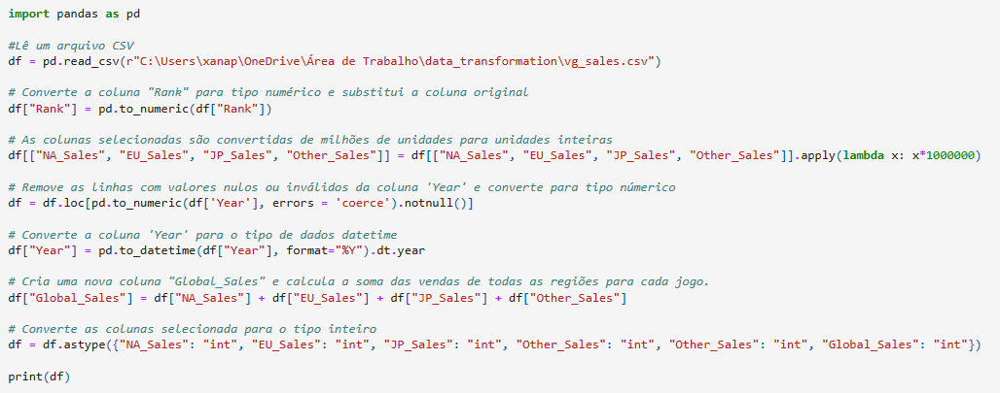
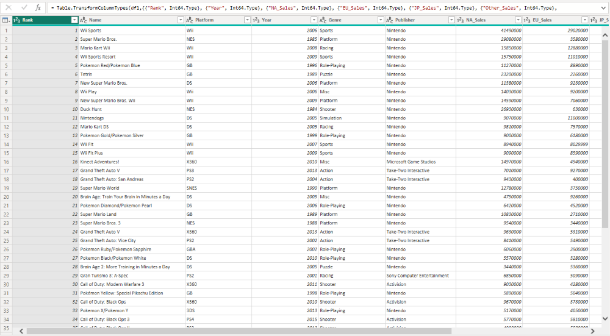
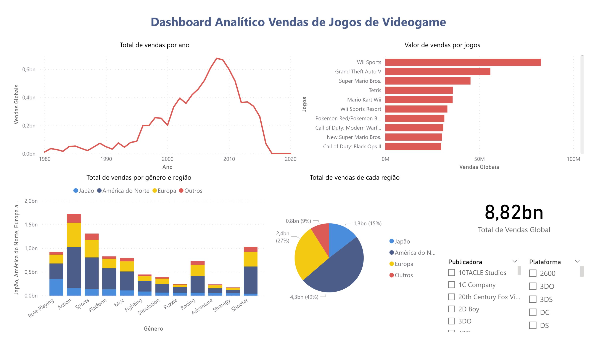

<h1> Transformação de dados usando python no Power BI :woman_technologist: </h1>

Na Academia Mulheres em Tech Data Engineer, oferecida pela Accenture e GamaAcademy, foi proposto um desafio para integrar o Python ao PowerBI. O objetivo do exercício é utilizar a biblioteca Pandas em Python para ler e transformar um arquivo CSV e, em seguida, abrir o arquivo transformado diretamente no PowerBI Desktop utilizando um script em Python.

<h2> Código em python utilizado para realizar a transformação dos dados </h2>

<h2> Tabela após a transformação dos dados </h2>

<h2> Análise dos dados </h2>

<h3>Arquivo CSV </h3>

O arquivo vgsales.csv contém dados sobre vendas de jogos de videogame, incluindo informações como nome do jogo, plataforma, ano de lançamento, editora e vendas globais em milhões de unidades. O conjunto de dados abrange jogos lançados entre os anos de 1980 e 2016. É possível encontrar o arquivo no link: <a href="https://www.kaggle.com/datasets/gregorut/videogamesales?resource=download">Video Game Sales - Kaggle</a>

<h3>Visualização do dashboard </h3>

## 🛠 Tecnologias Usadas

- Python 
- Pandas 
- Power BI 
- Jupyter Notebook 
